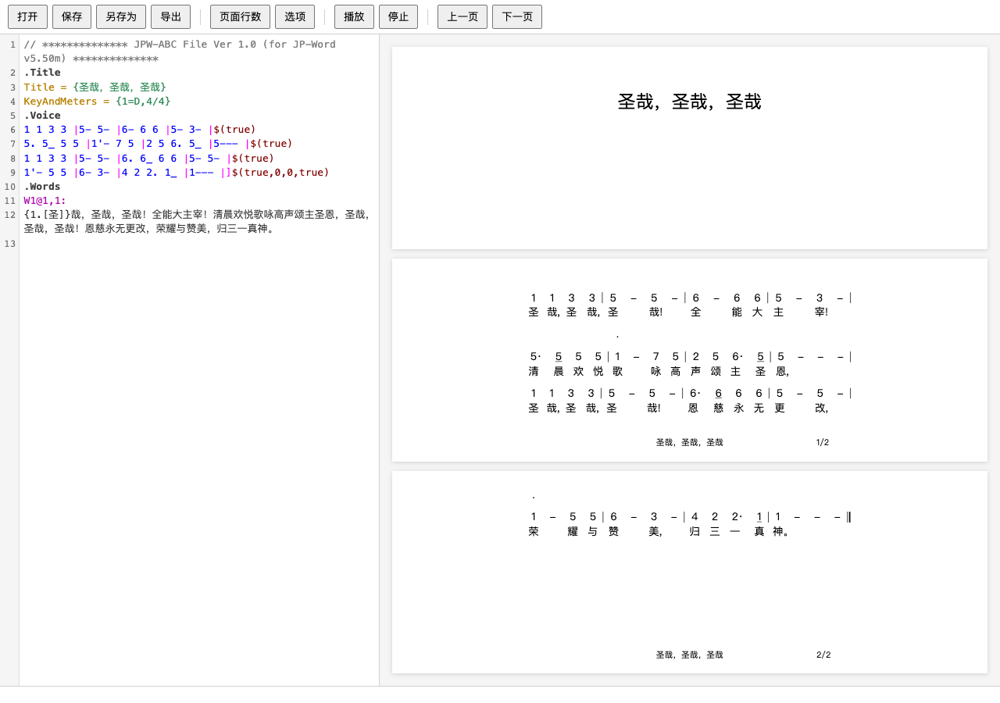

# jpeditor-web

简谱（JP-Word / `.jpwabc`）排版与编辑器 —— **Tauri 2 + TypeScript + SVG** 版。

由原 Kotlin/JVM + JavaFX + Skija 桌面应用迁移而来：体量更轻、跨平台分发更简单、单一现代技术栈。
左侧高亮代码编辑器，右侧实时简谱预览，支持点选、翻页与文件读写。



## 特性

- **`.jpwabc` 实时编辑**：CodeMirror 6 编辑器 + 语法高亮，编辑即重排重渲染
- **SVG 矢量渲染**：乐谱以 SVG 绘制，分辨率无关；用浏览器 `getBBox` /
  `getComputedTextLength` 测量，与渲染同一引擎、天然一致
- **点选与高亮**：点击音符/歌词即选中（CSS 高亮，不重渲染），状态栏显示信息
- **分页**：按比例自动分页（16:9 / 4:3 / A4），可设每页行数
- **文件**：打开 / 保存 / 另存为 / 拖拽打开（UTF-16LE 编解码，兼容 JP-Word）

## 技术栈

| 层 | 选型 |
|---|---|
| 外壳 | Tauri 2（Rust） |
| 前端 | TypeScript + Vite |
| 编辑器 | CodeMirror 6 |
| `.jpwabc` 解析 | ANTLR 4（`Jpwabc.g4` 生成 TS） + `antlr4` 运行时 |
| 渲染 | 原生 SVG DOM |
| 字体 | Bravura（SMuFL） + 系统中文字体 |

## 开发

前置：Node ≥ 20、Rust（含 cargo）、（改文法时）JDK。

```bash
npm install

npm run dev          # Vite 开发服务器（仅前端）
npm run tauri dev    # 跑桌面应用（需 Rust）
npm run build        # tsc 严格检查 + 打包
npx tsc --noEmit     # 仅类型检查

# 无头渲染/交互校验（用本地 Edge，免下载 chromium）
npm run build && node shot.mjs /tmp/out.png
```

## 项目结构

```
src/
  common/   Fraction、几何(Point/Rect/Matrix33)、SVG 测量基础设施
  smufl/    Bravura 元数据加载 + 字形码
  jpword/   .jpwabc 分段解析 + ANTLR 生成的词法/语法 + 高亮分词器
  score/    乐谱数据模型 + jpw 导入
  layout/   排版引擎 + SVG 渲染(painter)
  editor/   编辑器/渲染/翻页/文件 I/O 控制器、对话框
src-tauri/  Rust 后端（文件 I/O、对话框；导出待加）
public/redist/  Bravura 字体与元数据
```

数据流：`.jpwabc → JpwFile → ANTLR → fromJpw → Score → 排版 → SVG`。

## 进度

- [x] 脚手架、字体/测量基础设施
- [x] 解析 → 模型 → 导入 → 排版 → SVG 渲染
- [x] 编辑器 + 实时重排 + 文件读写 + 翻页
- [x] 点选/选中高亮 + 页面行数/选项（比例/字号/颜色）对话框
- [x] 导出 PNG / 矢量 PPTX / MIDI
- [x] MusicXML 导入 → `.jpwabc`（TypeScript，DOMParser）
- [x] 跨平台打包（`npm run tauri build`）

打包产物（Apple Silicon）：`jpeditor.app` ≈ 11MB、`.dmg` ≈ 4.6MB
（原 JVM + JavaFX + Skija 版含 JRE 通常 100MB+）。

> 已放弃原项目的 JAXB（MusicXML 改为 TypeScript 解析）与 IDML 导出。

## 许可

随附 Bravura 字体（SIL OFL，见 `public/redist`）。
