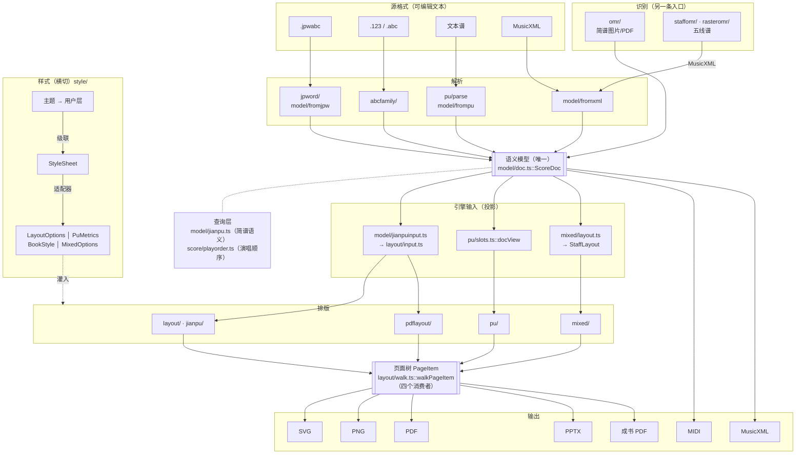

# 架构

> **技术栈、怎么构建、为什么这么分层、哪些决策不要推翻**。要做什么见 [需求.md](需求.md)；
> 每个模块的入口与判据见 [模块/](模块/)；阈值与踩坑全录在 [实现/](实现/)。

## 技术栈与构建

| 层 | 选型 |
|---|---|
| 外壳 | Tauri 2（Rust） |
| 前端 | TypeScript + Vite |
| 编辑器 | CodeMirror 6 |
| `.jpwabc` 解析 | ANTLR 4（`Jpwabc.g4` 生成 TS，重生成见 [源格式-jpwabc](模块/源格式-jpwabc.md)）+ `antlr4` 运行时 |
| 渲染 | 原生 SVG DOM |
| 字体 | Bravura（SMuFL，`public/redist/`）+ 系统中文字体 |

前置：Node ≥ 20、Rust（含 cargo）、（改文法时）JDK。

```bash
npm install
npm run dev            # Vite 开发服务器（仅前端）
npm run tauri dev      # 跑桌面应用（需 Rust）
npm run build          # tsc 严格检查 + 打包
npm run build:cli      # vite.cli.config.ts：不碰 DOM 的模块打成 Node ESM（dist-cli/），给无头脚本 import
npx tsc --noEmit       # 仅类型检查
cd src-tauri && cargo check   # 仅检查 Rust 侧
```

## 1. 架构决策（已定，勿轻易推翻）

| # | 决策 | 理由 |
|---|---|---|
| A1 | **渲染用 SVG**（不是 Canvas 2D / CanvasKit） | 页面树（`PageItem`/`Group`/`GraphicPath`/`GraphicLine`/`TextFrame`）直接映射 SVG DOM；矢量、可点选、可导出 |
| A2 | **「在哪测量就在哪绘制」** | 排版期用浏览器 `getBBox` / `getComputedTextLength`（`src/common/measure.ts`），与渲染同一引擎，天然一致。**不需要原生字体测量、不需要 CanvasKit、不需要 DPI 位图缩放** |
| A3 | **逻辑全在前端 TS** | 排版/渲染/模型/编辑都在 TS，同一套代码跑 Web 与桌面 |
| A4 | **Rust 只做原生加速** | PDF 导出（`svg2pdf` + `lopdf`）、ONNX 推理（比 wasm 多线程快 ~3×）、macOS MIDI 播放；文件 IO 与对话框用 Tauri 插件 |
| A5 | **一个语义模型 `ScoreDoc`，排版引擎只吃它的投影** | 各格式读进同一份模型，引擎输入（简谱 `layout/input.ts`、五线谱版面态 `StaffLayout`）由它投影、不另存语义；MusicXML 存回时没改过给原文，改过整份重写（读不懂的节点挂 `Measure.raw` 原样留着，不再 patch） |

## 2. 分层



## 3. 两个共用契约

**改这两处要格外当心——它们是多条路的交汇点。**

### 3.1 `PagePainter`（`src/layout/pagepainter.ts`）

```ts
interface PagePainter { pageCount; pageSize(i); renderPage(i): SVGSVGElement }
```

唯一的排版器 `ScorePainter`（简谱原样 / 展开、五线谱 / 混排）与退役中的 `PuPainter` 都实现它，
编辑器铺页逻辑只依赖它。**高亮不在接口里**——三者语义不同。
收成一个具体 `ScorePainter` 的设计与计划见 [实现/PuPainter退役.md](实现/PuPainter退役.md)（P0—P2 已完成，`PuPainter` 待迁入）。

### 3.2 `walkPageItem`（`src/layout/walk.ts`，54 行）

页面树的**唯一遍历骨架**，四个消费者共用：SVG DOM 两路（`svgVisitor` / `mixedVisitor`）、
成书 DrawList（`pdflayout/browser.ts`）、PPTX 形状（`editor/pptx.ts`）。

> 骨架只管「怎么走」，**坐标与颜色语义由各自 visitor 决定**——`mixedVisitor` 把 matrix 加在**叶子**上、
> 线与文字写死 black、只递归 Group；`svgVisitor` 每个 item 都产生 `<g>`、颜色取 item、无条件递归。
> **这些差别不许收进骨架。**

## 4. 数据流

| 源 | 路径 |
|---|---|
| `.jpwabc` | `JpwFile.fromString` → `jpwToScoreDoc` → `ScoreDoc` → `jianpuInputOfJpw` → `ScorePainter`（原样／展开） |
| `.123` | `parse123` → `ScoreDoc` →（`pu/slots.ts` 排版行视图）→ `jianpuInputOfDoc` → `ScorePainter`（原样单声部／展开；多声部原样回落 `PuPainter`） |
| 文本谱 | `parsePu` → `ScoreDoc`（内部经语法树 `parsePuAst` → `puToScoreDoc`）→ 同 `.123`；乐句重排读模型上的原文区间改写原文 |
| MusicXML | 打开：`loadScoreDoc` → `ScoreDoc` → 同 `.123`（简谱档）／同一份 `ScoreDoc` → `layoutStaff` → `StaffLayout`（版面态）→ `ScorePainter`（五线谱/混排），**无代码区**；改动经 `toxml.ts` 整份重写 |
| `.abc` | `parseAbc` → `ScoreDoc` → 同 `.123`；读不动才回落 `abcToMusicXml` → `jianpuInputOfXml` |
| 简谱图片/PDF | OMR 管线 → `RecognizedScore` → `recognizedToDoc` → `ScoreDoc` → 123 核对文本（或 JPWABC / ABC / 文本谱，同一张转换目标表） |
| 五线谱 PDF | `staffomr`（矢量）／`rasteromr`（位图）→ MusicXML → 混排视图 |
| 成书 | MusicXML → `ScoreDoc` → `jianpuInputOfXml` + 断句（`phrasedoc.ts`，按元素 id 写回）→ 简谱引擎 → 页面树 → DrawList → PDF |
| 试听/MIDI | `ScoreDoc` → `model/playsong.ts::playSourceOf`（按形状分给 `playSourceOfDoc` / `playSourceOfSong`）→ `buildTimeline`，高亮按元素 id |

## 5. 模块地图

| 目录 | 职责 | 模块文档 |
|---|---|---|
| `src/model/` | **语义模型 `ScoreDoc`**（五种格式共用）+ 各格式进出 + 简谱语义层 + 简谱引擎输入投影 + 格式能力表 | [模型-scoredoc](模块/模型-scoredoc.md) |
| `src/j123/` | **123 格式**（简谱主格式）的组装与薄壳 | [源格式-123](模块/源格式-123.md) |
| `src/abcfamily/` | **ABC 家族**：词法/写出基类 + 123 与标准 ABC 两个方言 | [源格式-abc家族](模块/源格式-abc家族.md) |
| `src/score/` | 演唱顺序（`playorder.ts`）+ 乐句断句（`phrase.ts`/`applybreaks.ts`）+ 试听时间线/MIDI + 调号音高工具（`jppitch.ts`） | [排版-简谱引擎](模块/排版-简谱引擎.md) · [编辑器与播放](模块/编辑器与播放.md) |
| `src/jpword/` | `.jpwabc` 分段与 ANTLR 解析 | [源格式-jpwabc](模块/源格式-jpwabc.md) |
| `src/pu/` | 文本谱解析、排版、转换、重排 | [源格式-文本谱](模块/源格式-文本谱.md) |
| `src/abc/` | abc2xml 忠实移植（**降为对照基准与 fallback**） | [源格式-abc家族](模块/源格式-abc家族.md) |
| `src/layout/` | 简谱排版引擎（`.jpwabc`、展开档、成书）+ 引擎输入接口 + SVG 绘制 + 字形原语 | [排版-简谱引擎](模块/排版-简谱引擎.md) |
| `src/jianpu/` | 两种格式「展开/原样」的公共语义 | [排版-展开与原样两档](模块/排版-展开与原样两档.md) |
| `src/mixed/` | 五线谱/混排模型与渲染（移植 musicpp） | [排版-五线谱混排](模块/排版-五线谱混排.md) |
| `src/style/` | **样式层**：`StyleSheet`、单位（em/pt/sp）、级联、内置主题，四把尺子的适配器 | [样式与设置](模块/样式与设置.md) |
| `src/pdflayout/` | 成书/歌集级版面、书级元数据、书籍样式 | [排版-成书](模块/排版-成书.md) |
| `src/omr/` | 简谱图片识别 + 矢量 PDF 对象层 | [识别-简谱omr](模块/识别-简谱omr.md) |
| `src/staffomr/` | 矢量五线谱 PDF 识别 | [识别-五线谱矢量](模块/识别-五线谱矢量.md) |
| `src/rasteromr/` | 位图五线谱识别（合唱谱） | [识别-五线谱位图](模块/识别-五线谱位图.md) |
| `src/editor/` | 编辑器控制器、**源格式适配器表**、导出、播放、OMR 控制器 | [编辑器与播放](模块/编辑器与播放.md) · [导出](模块/导出.md) |
| `src/common/` | 测量（**核心**）、几何、分数、CJK 标点、扩展名白名单 | — |
| `src/smufl/` | Bravura 元数据 + GlyphCodes | — |
| `src/cli/` | Node CLI 入口（不碰 DOM） | — |
| `src-tauri/` | Tauri 2 外壳 + 三块原生能力 | [编辑器与播放](模块/编辑器与播放.md) |
| `public/redist/` | Bravura 字体与 SMuFL 元数据 | — |

## 6. 两条主线

### 6.1 模型主线

**已收敛到一个模型**：`src/model/doc.ts` 的 `ScoreDoc` 装得下和弦、力度、多声部、版面坐标、断行，
五种格式都读进它、从它写出。两个排版引擎各自只留引擎内部结构：

| 引擎 | 读什么 | 内部结构 |
|---|---|---|
| 简谱（`layout/`） | `model/jianpuinput.ts` 投影出的只读输入（`layout/input.ts`，按 MusicXML 形状 / 简谱形状 / `.jpwabc` 三个分支） | `Line` / `Entry` / `NoteEntry` |
| 五线谱混排（`mixed/`） | `mixed/layout.ts::layoutStaff` 从 `ScoreDoc` 建的版面态 | `StaffLayout` 及各 `*Layout` 节点（带 `src` 引用模型元素） |

派生量（唱名、减时线、调号上下文、演唱顺序）不存进模型，经查询层取（`model/jianpu.ts`、`score/playorder.ts`）。
分工与判据见 [模块/模型-scoredoc.md](模块/模型-scoredoc.md)，还剩的尾巴见 [待办.md](待办.md) §3.1。

### 6.2 样式主线

**入口收成一个**：`src/style/` 的 `StyleSheet`。内置主题（`themes.ts`：projection / print / book / staff）
叠上用户层（编辑器面板）或歌本样式表（`.jpcss`；成书的 `BookStyle` 也由它算出，没有 json），经 `cascade.ts::computeStyle` 按上下文
（档位 / 引擎 / 分页 / 页位 / 段号）得到 computed 样式表，再由适配器灌进各引擎自己的尺子：

| 尺子 | 位置 | 适配器 | 服务对象 |
|---|---|---|---|
| `LayoutOptions` | `src/layout/options.ts` | `style/jianpu.ts`（预设 original / pptx / book） | `.jpwabc` 原样档、展开档、成书 |
| `PuMetrics` | `src/pu/metrics.ts` | `style/pu.ts` | 文本谱原样档（从原版实测得来） |
| `BookStyle` | `src/pdflayout/bookstyle.ts` | `style/book.ts`（`book` 预设） | 成书（从原书统计中位数得来） |
| `MixedOptions` | `src/mixed/model.ts` | `style/staff.ts` | 五线谱 / 混排（tenths） |

**尺子本身不合并**：各自的常量是实测来的、公式口径不同（pt / tenths；原书量到的墨迹高一律在生成样式时折成字号，样式值不收墨迹高），
所以主题只选预设、再叠逐字段 `overrides`，公式留在适配器里。机制与判据见 [样式机制.md](样式机制.md)。

## 7. 平台与打包

- **Web**：Vite 打包，GitHub Pages 部署
- **桌面**：Tauri 2（macOS `.dmg` / Windows `.exe`）；新增插件要同改的四处、Windows 内置 VC++ 运行库见 [编辑器与播放](模块/编辑器与播放.md)「Tauri 外壳」
- **更新检查与反馈入口**（只在桌面版，帮助对话框的「关于」页）：查 GitHub Releases 比版本号 + `mailto:`，
  为什么不上 updater 插件、节流判据见 [编辑器与播放](模块/编辑器与播放.md)「更新检查与反馈入口」
